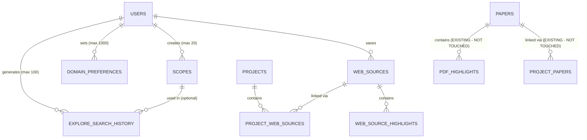

# Schema Decisions: ScholarSync Explore Module
**Generated:** 2026-03-31
**Source:** .planning/data-requirements.md
**New tables:** 6
**New indexes:** 16
**New enums:** 5
**Existing tables modified:** 0 (non-destructive)

---

## Design Philosophy

- **Non-destructive.** The `papers` table and all existing academic infrastructure are NEVER touched. Web sources get a completely separate table (`web_sources`). Zero regression risk.
- **Follow existing patterns.** New tables use the same conventions as existing tables: `serial` primary keys, `text` for Clerk user IDs, `timestamp` with `defaultNow()`, `jsonb` for arrays, same enum pattern.
- **Soft deletes on user content** (web sources — 30-day recovery). **Hard deletes on configuration** (scopes, domain preferences, search history — recreatable instantly).
- **Future-proofed for:** Scope sharing, community domain rankings, import/export, teams/organizations. None built yet, but no blockers in the schema.

---

## Table-by-Table Decisions

### 1. web_sources

**Why it exists:** Stores non-academic content (news articles, blog posts, Reddit threads, government reports) that users save from Explore. Completely separate from `papers` to avoid any risk to the academic pipeline.

| Column | Type | Why This Type | Why This Constraint |
|--------|------|--------------|-------------------|
| id | serial PK | Matches existing pattern (papers, projects use serial) | Auto-increment |
| user_id | text NOT NULL | Clerk user IDs are strings | Every source belongs to one user |
| url | text NOT NULL | URLs can be long, text has no limit | Every source has a URL |
| domain | text NOT NULL | Extracted from URL for filtering/sorting | Always derivable from URL |
| title | text NOT NULL | Page title, auto-captured | Every source has a title |
| snippet | text | Preview text from search results | May not always be available |
| author | text | Author name when detectable | Not always available |
| publish_date | timestamp | When the source was published | Not always detectable |
| source_type | enum | 7 fixed types (news_article, blog_post, etc.) | Stable set, unlikely to change frequently |
| trust_tier | enum | 4 fixed tiers (government, major_journalism, community, other) | Stable set |
| tab_found_on | enum | 4 tabs (academic, web, news, discussions) | Stable set |
| search_query | text | The query that found this source | Provenance tracking |
| thumbnail_url | text | OG image or favicon URL | Optional |
| content_html | text | Clean HTML from Readability/Firecrawl | For rendering in reader view + highlight anchoring |
| content_plain | text | Plain text version | For full-text search |
| content_extracted | boolean | Whether extraction has completed | Background job status flag |
| notes | text | User's personal notes | Free text, optional |
| tags | jsonb (string[]) | User-defined tags | Flexible, no fixed taxonomy |
| status | enum | saved or archived | Simple two-state lifecycle |
| metadata | jsonb | Any additional captured data | Future-proof catch-all |
| created_at | timestamp | When saved | Standard |
| updated_at | timestamp | Last user edit | Standard |
| deleted_at | timestamp | Soft delete (30-day recovery) | NULL = active, set = trashed |

**Indexes:**
| Index | Columns | Why |
|-------|---------|-----|
| web_sources_user_url_unique | (user_id, url) | One save per URL per user — prevents duplicates |
| idx_web_sources_user | user_id | All queries filter by user |
| idx_web_sources_domain | domain | Filter by domain in Library |
| idx_web_sources_source_type | source_type | Filter by content type |
| idx_web_sources_trust_tier | trust_tier | Filter by quality tier |
| idx_web_sources_status | status | Filter saved vs archived |
| idx_web_sources_created | created_at | Sort by date saved |

**Design choice — content_html in same table:** The content snapshot is stored in the same table (not a separate content store) for simplicity. At 1,000 users with average 50 saves each, that's 50,000 rows with text content — well within PostgreSQL's comfort zone. If content size becomes a concern at scale, it can be moved to a separate table or object storage without changing the API.

**Design choice — tags as JSONB, not a separate table:** Tags are user-defined strings with no shared taxonomy. A join table would add complexity without benefit at this scale. The existing `project_papers` table uses the same pattern (`tags: jsonb`).

---

### 2. web_source_highlights

**Why it exists:** Stores user highlights on saved web source content. Same concept as `pdf_highlights` but anchored to HTML content via character offsets instead of PDF page coordinates.

| Column | Type | Why |
|--------|------|-----|
| id | serial PK | Standard |
| web_source_id | integer FK → web_sources | Cascade delete — highlight dies with source |
| user_id | text NOT NULL | Owner tracking |
| selected_text | text NOT NULL | The highlighted passage |
| start_offset | integer NOT NULL | Character offset in content_html |
| end_offset | integer NOT NULL | Character offset in content_html |
| color | enum (annotation_color) | Same 5 colors as PDF highlights |
| note | text | Optional note on this highlight |
| created_at | timestamp | Standard |
| updated_at | timestamp | Standard |

**Design choice — no page_number or rects:** Unlike PDFs, web content is a single continuous document. Character offsets are sufficient for anchoring. No page geometry needed.

**Design choice — reuses annotationColorEnum:** Same 5 colors (yellow, green, red, blue, purple) as PDF highlights. One annotation system, one color set. Consistent UX.

---

### 3. project_web_sources

**Why it exists:** Links web sources to projects. Follows the exact same pattern as `project_papers`. One web source can be in many projects. Each link has its own notes and tags.

| Column | Type | Why |
|--------|------|-----|
| id | serial PK | Standard |
| project_id | integer FK → projects | Cascade — project deleted, link deleted, source survives |
| web_source_id | integer FK → web_sources | Cascade — source deleted, link deleted |
| user_notes | text | Per-project notes (different from source-level notes) |
| tags | jsonb (string[]) | Per-project tags |
| status | enum (web_source_status) | Per-project status |
| added_by | text | How it was added (search, manual, etc.) |
| created_at | timestamp | Standard |

**Design choice — mirrors project_papers:** Deliberately identical structure so the Library module can query both tables with the same patterns.

---

### 4. scopes

**Why it exists:** Stores user-created search profiles (like Kagi Lenses). Max 20 per user. Free for all plans.

| Column | Type | Why |
|--------|------|-----|
| id | serial PK | Standard |
| user_id | text NOT NULL | Owner |
| name | text NOT NULL | Display label |
| included_domains | jsonb (string[]) | Up to 10 domains to include |
| excluded_domains | jsonb (string[]) | Up to 10 domains to exclude |
| included_keywords | jsonb (string[]) | Up to 5 keywords to require |
| excluded_keywords | jsonb (string[]) | Up to 5 keywords to exclude |
| date_from | timestamp | Optional date range start |
| date_to | timestamp | Optional date range end |
| region | text | Optional region filter |
| is_active | boolean | Toggle on/off without deleting |
| sort_order | integer | Drag-handle reordering |
| created_at | timestamp | Standard |
| updated_at | timestamp | Standard |

**Design choice — no soft delete:** Scopes are configuration, not content. Recreating takes 30 seconds. No recovery needed.

**Design choice — JSONB for domain/keyword lists:** Small arrays (max 10/5 items). No need for a separate join table. Same pattern as tags elsewhere in the codebase.

**Future-proofing:** When Scope sharing is built, add `share_token` (text, unique) and `is_shared` (boolean) columns. No schema redesign needed.

---

### 5. domain_preferences

**Why it exists:** Stores user's Mute/Lower/Higher/Prefer preferences for specific domains. Neutral is NOT stored (absence = neutral). Max 1000 per user.

| Column | Type | Why |
|--------|------|-----|
| id | serial PK | Standard |
| user_id | text NOT NULL | Owner |
| domain | text NOT NULL | The domain (e.g., dailymail.co.uk) |
| level | enum | mute, lower, higher, prefer (4 values — neutral not stored) |
| created_at | timestamp | When first set |
| updated_at | timestamp | When last changed |

**Design choice — enum with 4 values, not 5:** Neutral is the absence of a record. Storing "neutral" would be meaningless — it's the default state. This keeps the table lean (only non-default preferences stored).

**Design choice — unique on (user_id, domain):** One preference per domain per user. Updating changes the level, not creates a new row.

**Future-proofing:** Community rankings will aggregate anonymized data from this table. The schema supports this without changes — just a read query across all users.

---

### 6. explore_search_history

**Why it exists:** Recent Explore searches for user convenience. Clock icon dropdown. Max 100 per user (FIFO).

| Column | Type | Why |
|--------|------|-----|
| id | serial PK | Standard |
| user_id | text NOT NULL | Owner |
| query | text NOT NULL | The search query |
| active_tab | enum | Which tab was active |
| scope_id | integer FK → scopes (SET NULL) | Which Scope was active (nullable) |
| created_at | timestamp | When searched |

**Design choice — scope_id with SET NULL:** If a Scope is deleted, the history entry survives but scope_id becomes null. History is a log — it shouldn't break when configuration changes.

**Design choice — no soft delete:** History is ephemeral. Delete = gone. FIFO at 100 entries — oldest automatically dropped.

**Privacy:** This table is NEVER queried for analytics. Purely for user convenience. Aligns with Kagi's privacy philosophy.

---

## Relationship Map

---

## What Is NOT Changed

| Existing Table | Status |
|---|---|
| papers | NOT TOUCHED |
| project_papers | NOT TOUCHED |
| paper_chunks | NOT TOUCHED |
| pdf_highlights | NOT TOUCHED |
| evidence_notes | NOT TOUCHED |
| source_quotes | NOT TOUCHED |
| search_queries | NOT TOUCHED |
| users | NOT TOUCHED (usage counters can be added later as nullable columns) |
| projects | NOT TOUCHED (project_web_sources handles the new link) |

---

## Migration Safety Notes

- All 6 new tables are CREATE TABLE — no modifications to existing tables
- All new enums are CREATE TYPE — no modifications to existing enums
- Zero risk of breaking existing functionality
- Can be rolled back by dropping the 6 tables and 5 enums
- No NOT NULL columns on existing tables (no table rewrites)
- Indexes are standard B-tree (created inline with table, no CONCURRENTLY needed for new tables)

---

## Future Expansion Notes

**When adding teams/organizations:**
- Add `organization_id` column to `web_sources`, `scopes`, `domain_preferences`
- Add corresponding indexes
- No existing data migration needed (new column is nullable)

**When adding Scope sharing:**
- Add `share_token` (text, unique) and `is_shared` (boolean) to `scopes`
- No schema redesign

**When adding export/import:**
- All data in standard types (text, jsonb, timestamps)
- CSV/JSON export is a simple SELECT query
- Import maps cleanly to INSERT statements

**When adding community domain rankings:**
- Aggregate query across `domain_preferences` table (GROUP BY domain, level, COUNT)
- No new tables needed for V1 of community rankings
